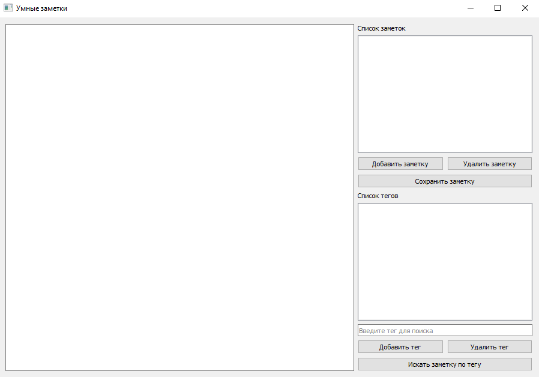
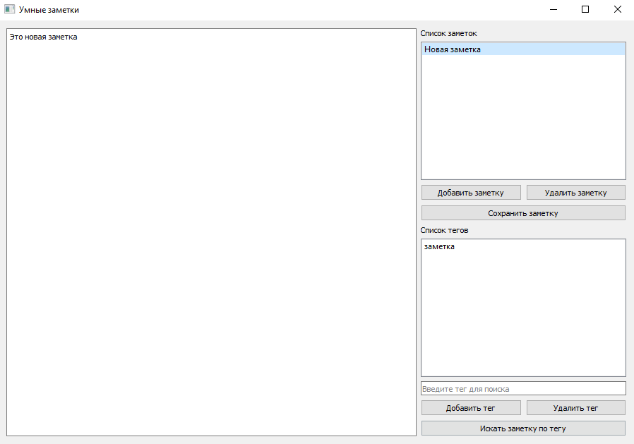

# 📒 Smart Notes

**Smart Notes** --- настольное приложение для создания, редактирования и
хранения текстовых заметок.

Проект разработан на Python с использованием библиотеки PyQt5. Данные
заметок сохраняются локально в формате JSON.

## Возможности

-   создание новых заметок;
-   редактирование текста заметок;
-   сохранение заметок;
-   удаление заметок;
-   хранение данных в локальном файле `notes.json`;
-   простой графический интерфейс.

## Скриншоты

### Главное окно



### Работа с заметками



## Используемые технологии

-   Python 3.8+
-   PyQt5
-   JSON

## Как установить

1.  Скачайте проект.
2.  Перейдите в папку проекта:

``` bash
cd smart_notes
```

3.  Установите зависимости:

``` bash
pip install -r requirements.txt
```

## Как запустить

``` bash
python main.py
```

## Как пользоваться

### Создание новой заметки

1.  Нажмите кнопку **«Добавить заметку»**.
2.  Введите название заметки, нажмите **«ОК»**.
3.  В окне **«Список заметок»** выберите название нужной заметки.
4.  Введите текст заметки в основной (левой) части приложения.
5.  Нажмите **«Сохранить заметку»**.

### Редактирование заметки

1.  Выберите заметку в окне **«Список заметок»**.
2.  Измените текст заметки в основной (левой) части приложени.
3.  Нажмите **«Сохранить заметку»**.

### Удаление заметки

1.  Выберите заметку в списке в окне **«Список заметок»**.
2.  Нажмите кнопку **«Удалить заметку»**.

### Добавление тега для поиска заметки

1. Выберите заметку в списке в окне **«Список заметок»**.
2. Нажмите кнопку **«Добавить тег»**.
3. Введите название тега, нажмите **«ОК»**.
4. Введенный тег отображдается в списке в окне **«Список тегов»**.

### Удаление тега для поиска заметки

1. Выберите тег в списке в окне **«Список тегов»**.
2. Нажмите кнопку **«Удалить тег»**.
3. Удаленный тег не отображдается в списке в окне **«Список тегов»**.

### Поиск заметок по тегу

1. В поле **«Введите тег для поиска»** введите тег из списка в окне **«Список тегов»**.
2. Нажмите кнопку **«Искать заметку по тегу»**.
3. В окне **«Список заметок»** отображаеются только те заметки, которым соответствует выбранный тег
4. Для отмены поиска и возврата к основному списку заметок нажмите на кнопку **«Сброс фильтра»**.

## Структура проекта

``` text
smart_notes/
├── main.py
├── requirements.txt
├── README.md
├── .gitignore
├── notes.json
└── screenshots/
    ├── smart-notes_main_screen.png
    └── smart-notes_new_note.png
```

## Чему я научилась

Во время работы над проектом я научилась:

-   создавать графический интерфейс на PyQt5;
-   работать с виджетами, кнопками, списками и текстовыми полями;
-   сохранять данные в JSON-файл;
-   обрабатывать действия пользователя;
-   делать приложение, которое хранит данные между запусками.

## Автор

**Кузнецова Ксения**\
2026
